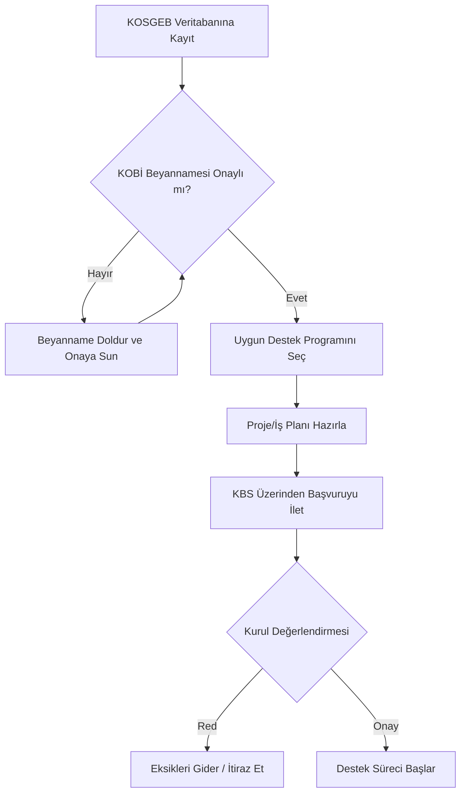

# KOSGEB Destekleri

KOSGEB, KOBİ'lerin rekabet güçlerini artırmak ve ekonomik büyümeye katkılarını sağlamak amacıyla çeşitli destek programları sunar.

## Başvuru Süreci İş Akışı

## Temel Destekler
1. **KOBİ Proje Destek Programı**
2. **Ar-Ge, İnovasyon ve Endüstriyel Uygulama**
3. **Gelişen İşletmeler Piyasası**

Daha fazla detay için resmi KOSGEB sitesini ziyaret ediniz.
