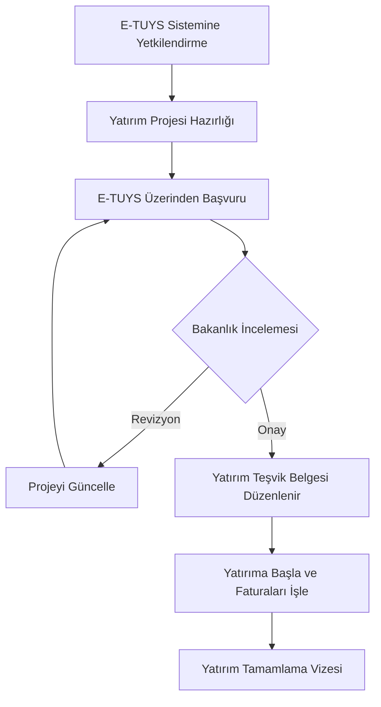

# Sanayi ve Teknoloji Bakanlığı & Yatırım Teşvikleri

Sanayi ve Teknoloji Bakanlığı, bölgesel kalkınmayı hızlandırmak ve teknolojik yatırımları artırmak için teşvikler verir.

## Yatırım Teşvik Belgesi Süreci

## Teşvik Türleri
- Bölgesel Yatırım Teşvik Mevzuatı
- Teknogirişim Sermayesi Desteği
- Teknoloji Geliştirme Bölgeleri (Teknoparklar)
